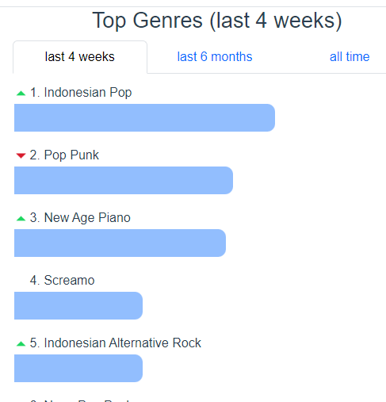
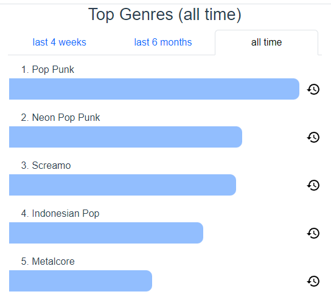
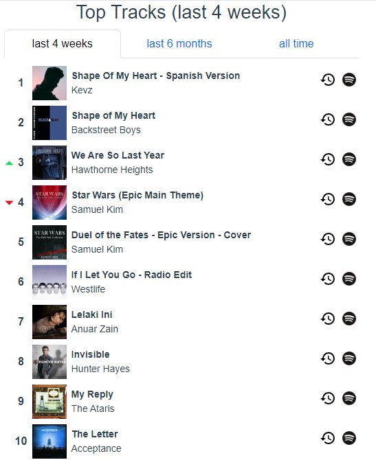
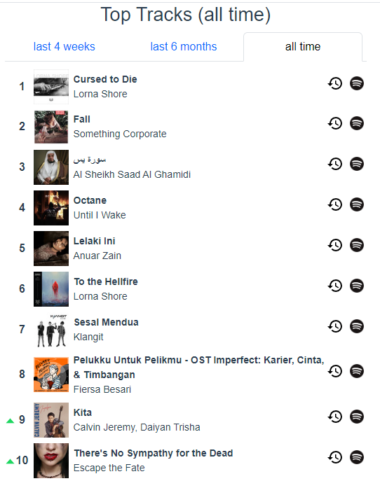

Aku ada terbaca satu post aku tulis tahun 2012 macam tu. Dalam post tu aku tulis lagu-lagu yang aku dengar zaman tu. Bila baca post tu rasa macam aku perlu buat lagi untuk tahun 2020 ke atas ni sebab bila baca di masa hadapan, dapat rasa balik vibe zaman tu. Basically, kembali ke masa lampau lah tanpa mesin masa lah.

Aku boleh simpulkan yang waktu dulu lagu aku banyak dengar lagu yang beat nya laju dan keras, terutamanya hardcore, metal dan EDM. Mungkin faktor umur membuatkan aku rasa macam tu. Aku perasan usia sekarang ni aku banyak dengar lagu-lagu slow, yang dah tak jerit-jerit. Dan aku dah boleh terima lagu-lagu balada dari 80s, 90s tu semua, termasuk yang ada dalam mainstream radio. Britney Spears, Backstreet Boys, Siti Nurhaliza, yang jenis-jenis jiwang tu.

Kalau dulu lagu-lagu aku download secara lanun. Sekarang mudah dan selesa, pakai Spotify je. Banyak lagi platform lain macam Youtube Music, Apple Music, JOOX. Disebabkan faktor nak migrasi tu susah, jadi malas nak tukar platform. Dah lama juga aku pakai Spotify ni. Sejak zaman pakai mod apk dan [modify hosts file][hosts] sampai lah aku subscribe terus plan dia. Banyak dah lagu aku dengar dan playlist pun dah berlambak aku buat. Jadi nak migrate tu bukan lah perkara yang mudah.

### Stats

Untuk menjana statistik ni aku pakai https://www.statsforspotify.com/.

**Top 5 genres**

|||

**Top 10 tracks**

|||

Nampak la dekat situ, lagu-lagu slow dah makin membuat proses kolonialisasi dalam playlist.

### Spotify playlist

Berikut adalah senarai playlist yang aku simpan:

- [Keras][keras] - Hardcore, post-hardcore, metal, deathcore, yang ada jerit-jerit paling rendah pun fry scream.
- [Tak Keras][tak-keras] - Punk, pop-punk, pop, emo, yang tak berapa jerit-jerit.
- [Galau-land][galau-land] - Balada, pop, galau, jenis-jenis lagu sadboy, putus cinta dan suara tarik, kebanyakkan artis popular yang masuk radio/tv.
- [Serumpun][serumpun] - campuran band/penyanyi dari Malaysia 🇲🇾 dan Indonesia 🇮🇩, tak kisah rock ke tak, asalkan yang ada vibe indie. playlist ni perlu dibersihkan btw.
- [Digital Resistance][digital-resistance] - synthwave, retrowave, dreampop, cyberpunk-esque, bila dengar rasa macam nak keluar drive waktu malam sorang-sorang, gitu.
- [Fengtau][fengtau] - EDM, trance, house, progressive, hardstyle, seperti namanya, Fengtau. Tapi jangan la mabuk-mabuk. Sekadar nak angguk-angguk je dengar beat dia.
- [175 BPM][175-bpm] - EDM, semuanya drum and bass. Dari liquid ke jungle. Sesuai untuk yang tengah exercise atau yang nak boost adrenaline.
- [Anti-Depressant][anti-depressant] - Lagu religi dan keagamaan 😇
- [Hitam Putih][hitam-putih] - piano solo, dengar bila waktu menulis atau aktiviti yang memerlukan fokus yang jitu.

Kebanyakkan waktu aku tak dengar pun playlist ni semua. Biasanya aku akan buka "Liked Songs" dan repeat lagu dari situ je. Playlist ni dah jadi sekadar koleksi je untuk aku simpan lagu dari zaman dulu sampai sekarang.

[keras]: https://open.spotify.com/playlist/5vpX658fCuVsxnqfiFzH8k?si=0529c414a6d2418f
[tak-keras]: https://open.spotify.com/playlist/7GvDNxQ0MdaPPYvuLefE7f?si=194f03b16da94d1d
[galau-land]: https://open.spotify.com/playlist/0VlGYnKHPXHnDdWAUX6Jla?si=8a0cfaf8dea44cc3
[serumpun]: https://open.spotify.com/playlist/4HI4RCionNtLl99cI4YVWg?si=e95f5efe24584201&pt=2d781ca124ac78b08dc661f92fe685e2
[digital-resistance]: https://open.spotify.com/playlist/4CsMGukIQxqO9LjzHYGC4P?si=fd1ad3c8b0a848df
[fengtau]: https://open.spotify.com/playlist/23IbrhiYskAoo5x6qDnIWw?si=99625e0f1aea4c2a
[175-bpm]: https://open.spotify.com/playlist/0sfIPuMBugecq0iOfWQa3y?si=85de834039b94d1c
[anti-depressant]: https://open.spotify.com/playlist/1KYY5exHfccrJYPdSXJxjh?si=2975748ef5ed4037&pt=e0c3aafc1d8da4b3857c924d4ae6692b
[hitam-putih]: https://open.spotify.com/playlist/46tSwphU6m4kzNxoGig1v5?si=078b7c2153e24891&pt=64daf17019da797eb02f3c64bbc33644
[hosts]: https://simpletech.xyz/article/block-ads-on-spotify-app/